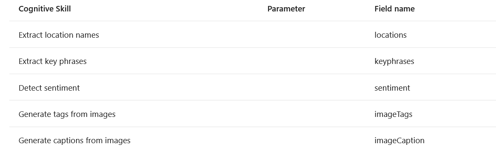
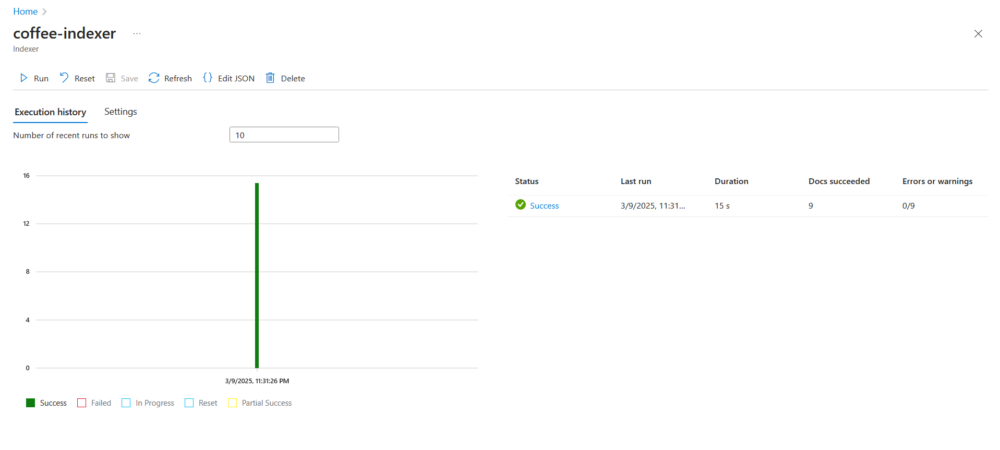

# Azure AI Search

> Challenge created as part of the Microsoft AI Fundamentals Bootcamp by DIO, based on the tutorial:

- [Explore an Azure AI Search index (UI)](https://aka.ms/ai900-ai-search)

---

## 1. Explore an Azure AI Search index (UI)

### 1.1. Provision an Azure AI services resource

- Start by provisioning an Azure AI services in the Azure portal.

- Search for *Azure AI services* in the Azure portal and create a new **Azure AI Search** resource.

- Search for *Storage Account* in the Azure portal and create a **Storage Account** resource.

### 1.2. Upload documents to Azure Storage
- In the left-hand menu pane, select **Containers**. Create a Container to upload the files.

<div align="center">
    
</div>

- The files used can be found in the folder <a href= './inputs'>input</a>.

- In the **Upload blob pane**, select **Select a file** and upload all files.

<div align="center">
    
</div>

### 1.3. Index the documents

- Now you can use Azure AI Search to extract insights from the documents. 

-  The Azure portal provides an Import data wizard. With this wizard, you can automatically create an index and indexer for supported data sources. 

- In the Azure AI resource, on the **Overview** page, select **Import data**. 

<div align="center">
    
</div>

- On the *Connect to your data* page, in the *Data Source* list, select **Azure Blob Storage**. Complete the data store details with the following values: 

```
    Data Source: Azure Blob Storage
    Data source name: coffee-customer-data
    Data to extract: Content and metadata
    Parsing mode: Default
    Connection string: *Select Choose an existing connection. Select your storage account, select the coffee-reviews container, and then click Select.
    Managed identity authentication: None
    Container name: this setting is auto-populated after you choose an existing connection.
    Blob folder: Leave this blank.
    Description: Reviews for Fourth Coffee shops.
```
- In the Attach AI Services section, select your Azure AI services resource.

- In the Add enrichments section: 
    - Change the Skillset name to **coffee-skillset**.
    - Select the checkbox **Enable OCR and merge all text into merged_content field**.
    - Ensure that the **Source data field** is set to **merged_content**.
    - Change the **Enrichment granularity level** to **Pages (5000 character chunks)**.
    - Don’t select *Enable incremental enrichment*
    - Select the following enriched fields:

<div align="center">
    
</div>

- Under **Save enrichments to a knowledge store**, select: 

    - Image projections
    - Documents
    - Pages
    - Key phrases
    - Entities
    - Image details
    - Image references

- Select **Choose an existing connection**. Choose the storage account you created earlier. 

- Select **Azure blob projections: Document**. A setting for *Container name with the knowledge-store* container auto-populated displays. Don’t change the container name.

- Select **Next: Customize target index**. Change the **Index name** to **coffee-index**.

- Ensure that the **Key** is set to **metadata_storage_path**. Leave **Suggester name** blank and **Search mode** autopopulated.

- Review the index fields’ default settings. Select **filterable** for all the fields that are already selected by default.

<div align="center">
    
</div>
<br />

- The field names that need to be marked **filterable** include: *content*, *locations*, *keyphrases*, *sentiment*, *merged_content*, *text*, *layoutText*, *imageTags*, *imageCaption*.

- Select Next: **Create an indexer**, change the **Indexer name** to **coffee-indexer** and leave the **Schedule** set to **Once**.

- Expand the **Advanced options**. Ensure that the **Base-64 Encode Keys** option is selected, as encoding keys can make the index more efficient.

- Select **Submit** to create the data source, skillset, index, and indexer. 

- Return to your *Azure AI Search* resource page. On the left pane, under **Search Management**, select **Indexers**. Select the newly created **coffee-indexer**.

- Select the indexer name to see more details.

### 1.4. Output

**Indexer:**
<div align="center">
    
</div>
<br />

- JSON attributes generated with positive sentiment <a href= './output/coffee-indexer-positive-sentiment.json'>here</a>.

- JSON attributes generated with negative sentiment <a href= './output/coffee-indexer-negative-sentiment.json'>here</a>.

### 1.5. Query the index

- Use the *Search* explorer to write and test queries. Search explorer is a tool built into the Azure portal that gives you an easy way to validate the quality of your search index.

- In your *Search* service’s Overview page, select **Search explorer** at the top of the screen.

<div align="center">
    
</div>
<br />

- Change the view to **JSON view**.

<div align="center">
    
</div>
<br />

- In the JSON query editor field, copy and paste:

```
{
    "search": "*",
    "count": true
}
```

- Select **Search**. The search query returns all the documents in the search index, including a count of all the documents in the **@odata.count** field. 

- Filtering by location: 

```
{
 "search": "locations:'Chicago'",
 "count": true
}

```

- Filtering by sentiment: 

```
{
 "search": "sentiment:'negative'",
 "count": true
}

```
